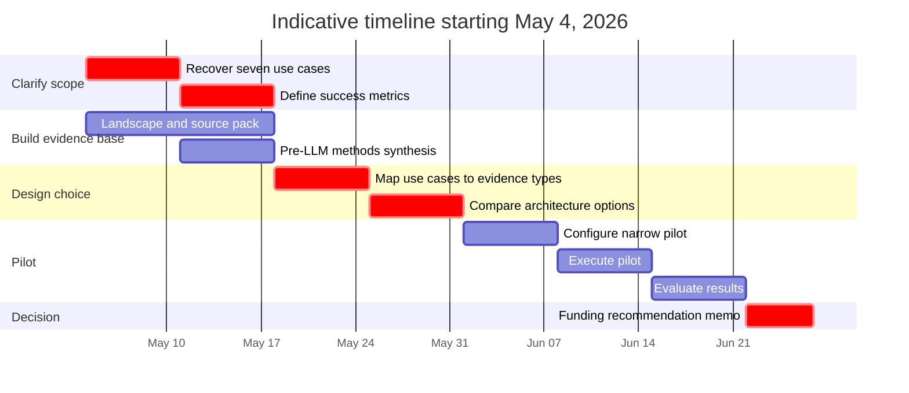
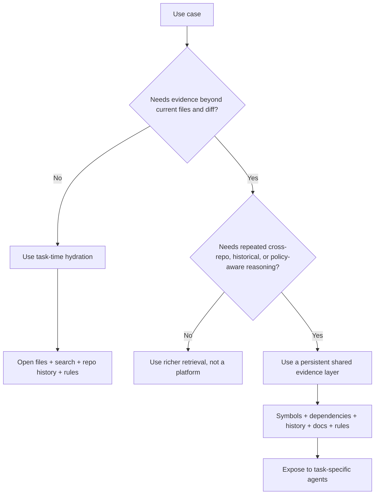

# Deep Research Report on the Shared Code Knowledge Brief

## Executive summary

The attached brief asks for a research memo on whether there should be a “shared code knowledge” layer for AI coding tools, with six concrete deliverables: a current landscape scan, a review of pre-LLM approaches, a critique of the original use cases, additional use cases, an annotated source list, and a recommendation on whether to fund the idea or stall it. The brief is clearly written in English, but it omits several decision-critical inputs: there is no deadline, no budget, no evaluation rubric, no security/compliance boundary, and—most importantly—the “seven use cases” from Chris’s original hypothesis document are referenced but not attached. That missing document is the most important information gap in the brief. fileciteturn0file0

The most defensible market-level conclusion is that leading tools are converging on the same architecture pattern: they do **not** rely only on ever-larger token windows. Instead, they combine persistent indexing, semantic retrieval, symbol/dependency understanding, repository history, rules/instructions, and task-specific tools. Official documentation from Sourcegraph, GitHub Copilot, Augment, Qodo, Greptile, Windsurf, Cursor, Tabnine, Bito, and Aider all describe some combination of search, graph traversal, AST-aware chunking, indexing, rules, or persistent memory layers. Diffblue is the main important exception because it is intentionally specialized around autonomous unit-test generation rather than general-purpose codebase chat or editing. citeturn15view0turn15view1turn4view2turn4view4turn13search0turn19view0turn19view1turn17view0turn4view1turn23search2turn26view0turn22search0turn30search1turn21view0

The evidence on productivity is materially mixed, which matters for any funding decision. GitHub’s controlled study reported significantly faster task completion with Copilot, Microsoft’s field RCTs found a causal increase in completed tasks, and GitHub’s own user research found strong perceived gains in flow and satisfaction. But METR’s randomized study of experienced open-source developers using frontier early-2025 tools found a **19% slowdown**, and a later NAV IT longitudinal study found perceived gains without statistically significant changes in commit-based activity after adoption. That means the right question is not “Does AI coding help?” but “For **which users, on which tasks, against which codebases, with which retrieval/evaluation scaffolding**?” citeturn10view0turn27search11turn9view2turn9view0turn27search0

My recommendation is **not** to fund a monolithic “all code archived for AI” platform as a large standalone bet yet. Instead, fund a **staged shared evidence layer**: a thin, queryable, governed service that exposes code, symbols, dependencies, history, docs, and rules to task-specific agents. In practice, that means prioritizing cross-repo impact analysis, planning, review support, and onboarding/architecture Q&A first, while treating test generation as a specialized workflow and incident/debugging as a broader “engineering knowledge” problem that must include logs, tickets, and ownership—not just code. That recommendation follows directly from the brief’s query, from the documented architecture of current tools, and from the mixed empirical evidence on productivity. fileciteturn0file0 citeturn15view1turn29view2turn19view1turn17view0turn21view0turn9view0turn27search0

## What the brief explicitly asks for

The brief’s explicit asks can be extracted cleanly. All rows in the table below come directly from the uploaded file. fileciteturn0file0

| Explicit item | What the file asks for | Expected output format | Deadline stated | Constraint or framing |
|---|---|---|---|---|
| Landscape scan | “State of AI use in the code archive / coding tool space” and analysis of specific commercial, open-source, and research tools | Research memo / report | None stated | Should include what works well and what does not; not just marketing claims fileciteturn0file0 |
| Historical methods | “What research methods and approaches were being experimented with prior to LAG / LLMs” and how they may apply now | Expository analysis | None stated | Should avoid being “wrapped around inputs/tokens context” only fileciteturn0file0 |
| Use-case critique | Analyze “what the 7 use cases are actually trying to do,” whether a “shared layer” is right, whether task-time context hydration would work, and whether the proposal is overengineered or under-specified | Decision-oriented critique | None stated | Dependent on a missing “original hypothesis document” from Chris fileciteturn0file0 |
| Additional opportunities | Identify additional use cases and where they are already done well | Comparative analysis | None stated | Should cover latest original work and practical tool reality fileciteturn0file0 |
| Source pack | “Annotated source list for every source” | Annotated bibliography / source table | None stated | Prioritize latest work from the last 2–3 years, with enough backstory to make it useful fileciteturn0file0 |
| Recommendation | “Conclusion/recommendation if this has water and how and whether to fund all of it or just call stall on the whole thing” | Executive recommendation | None stated | Honest failure modes, costs, and limitations are required, not optional fileciteturn0file0 |

The brief also implies a preferred final format even though it does not prescribe a template or page length: a structured analytical report with a recommendation section, rather than a slide deck, vendor matrix only, or implementation spec. It also explicitly favors recent work from the last two to three years, but it does **not** say to ignore older background where that background is necessary to understand the present landscape. fileciteturn0file0

A critical extraction result is that the brief names the research question clearly but does **not** define success. There is no explicit criterion such as review precision/recall, time-to-merge, defect escape rate, onboarding speed, planning accuracy, developer hours saved, or trust/compliance requirements. That omission is not just administrative; it changes the architecture decision materially, because the “right” shared layer depends on what outcome is being optimized. fileciteturn0file0

## Implicit requirements, information gaps, resources, and stakeholders

The single largest information gap is the absent “original hypothesis document” and its seven use cases. Because the brief asks for a critique of those use cases but does not attach them, any direct evaluation of the original hypothesis can only be provisional. The most I can do responsibly is infer likely use-case families from the tools and workflows that dominate the current market. fileciteturn0file0

A second implicit requirement is that the sponsor appears to want a **positioning and investment thesis**, not a product catalog. The brief repeatedly pushes beyond “tokens/context” discourse and asks whether the idea “has water” and whether to fund it. That means the output has to answer a strategic question: is the missing capability really “more context,” or is it a governed evidence layer that different agents can query for different jobs? fileciteturn0file0

A third implicit requirement is honest discussion of operational tradeoffs. Official docs already reveal some of them. GitHub Copilot’s code review and cloud agent consume GitHub Actions minutes and premium requests, and cloud agent runs are limited to one repository per run unless broader access is configured. Cursor’s indexing can be slowed by large repositories and ignored-file policies can be bypassed by terminal commands or MCP tools. Windsurf’s remote indexing is plan-dependent, and its file-count settings matter for large workspaces. Tabnine’s more advanced remote context requires connected repositories, admin setup, and server-side embedding computation for some chat use cases. Qodo, Augment, and Greptile all rely on indexing and/or pre-processing layers that add setup, governance, and freshness considerations. citeturn29view0turn29view2turn23search2turn23search9turn24search2turn24search12turn26view0turn26view1turn19view0turn13search14turn17view0

The stakeholder map is broader than “developers who want better code chat.” A decision of this type touches platform engineering, architecture, developer experience, code owners, repository administrators, security/compliance teams, QA/test leads, issue-tacker owners, and possibly support/incident teams if the knowledge layer is expected to help in production debugging. Current vendor documentation increasingly reflects that breadth: GitHub cloud agent integrates with Jira, Slack, Teams, and Linear; CodeRabbit supports Jira- and issue-based planning; Bito explicitly ingests code, Jira, docs, and observability; and Qodo positions its context engine as code intelligence that supports the SDLC, not only editor interaction. citeturn28search1turn2search3turn2search7turn22search0turn22search12turn19view0

The resource picture follows directly from those gaps and stakeholders. A meaningful evaluation requires at least a candidate use-case list, repository scope, code-host permissions, sample architecture docs, issue/PR history, security/privacy rules, and a cost envelope. Without those, a “shared layer” discussion stays at the level of plausible architecture rather than investment-grade product design. fileciteturn0file0

| Resource or input | Why it is required | Primary stakeholders | Notes |
|---|---|---|---|
| Chris’s original hypothesis document | Needed to evaluate the actual seven use cases, not a proxy set | Sponsor, product strategy, architecture | Missing from the attached file fileciteturn0file0 |
| Repository inventory and ownership model | Determines whether multi-repo intelligence matters enough to justify persistent indexing | Platform engineering, repo admins, architecture | Especially important for microservices or federated monorepos citeturn1view0turn15view0turn19view0 |
| Code-host and indexing permissions | Required for remote context, multi-repo review, and governance | Security, repo admins, platform engineering | Explicitly required by Augment, Tabnine, GitHub, Windsurf, and Qodo docs citeturn1view0turn26view0turn4view2turn24search2turn19view0 |
| Architecture docs, runbooks, ADRs, standards | Needed if the goal is architectural reasoning, not just snippet recall | Architecture, platform, team leads | Current tools increasingly rely on rules, docs, or uploaded context files citeturn2search9turn16search2turn4view1turn22search12 |
| PR, commit, and issue history | Needed for planning, reviewer grounding, regressions, and “why” questions | Developers, reviewers, engineering managers | Qodo, CodeRabbit, and Bito explicitly use history or issue workflows citeturn1view4turn19view1turn22search2 |
| Cost and policy envelope | Determines whether this is a platform service, vendor buy, or limited pilot | Finance, leadership, security | GitHub usage, runner cost, and premium-request models make this concrete rather than theoretical citeturn29view0turn29view2 |

## Prioritized execution plan and timeline

Because the brief contains **no explicit deadline**, the timeline below is an indicative plan starting from the current date, May 4, 2026. It assumes the goal is to produce an investment-quality recommendation and a pilot design rather than to ship a production platform immediately. That assumption is necessary because the brief asks for strategic recommendation language but does not define a delivery window or staffing plan. fileciteturn0file0

The right way to execute this work is to front-load clarification and task decomposition, not architecture. The broadest mistake teams make here is to build a generalized “code memory” platform before they know whether the highest-value task is review, planning, onboarding, impact analysis, test generation, or incident triage. Current tool architectures strongly suggest that task structure determines the right substrate: PR review tools lean heavily on diffs, repo history, and rules; onboarding and architecture assistants lean on search, symbols, docs, and graphs; and autonomous test generation depends on execution, coverage, and verification loops rather than on broad chat context alone. citeturn1view4turn29view0turn15view1turn21view0turn21view2

| Priority | Workstream | Assumed owner | Indicative due date | Main resources needed | Milestone |
|---|---|---|---|---|---|
| Highest | Recover or reconstruct the seven original use cases | Sponsor + architecture lead | Week of May 4 | Chris hypothesis doc, stakeholders, repo inventory | Agreed use-case stack |
| Highest | Define success metrics per use case | Product strategy + eng leadership | Week of May 11 | Baseline metrics, PR data, defect data, onboarding pain points | Scoring rubric signed off |
| High | Build source pack and landscape comparison | Research lead / DevEx architect | Week of May 11 | Official docs, academic studies, benchmark notes | Evidence base locked |
| High | Decompose each use case into required evidence types | Architecture + senior ICs | Week of May 18 | Sample repos, docs, issue history | Shared-layer necessity test complete |
| High | Choose architecture options | Platform engineering + security | Week of May 25 | Access model, policy constraints, hosting options | Option A/B/C design |
| Medium | Run limited pilot on 2–3 use cases | DevEx + volunteer teams | Weeks of June 1 and June 8 | One or two teams, representative repos, review/test workflows | Pilot readout |
| Medium | Make funding recommendation | Sponsor + leadership | Week of June 15 | Pilot metrics, cost model, risk register | Invest / narrow / stall decision |

A practical decision rule for the plan is simple: if a use case can be completed well with **ephemeral task hydration**—for example, a diff, a handful of files, repo history, and team rules—then a new persistent shared layer probably should **not** be built for that use case. If a use case repeatedly depends on cross-repo dependency chains, architectural topology, issue/PR history, and organization-specific guidance, then a persistent shared layer becomes much easier to justify. That distinction mirrors the architecture of GitHub Copilot’s search-and-read tools, Sourcegraph’s retrieval-and-ranking design, Greptile’s graph-based review, Qodo’s graph/vector/history stack, and Diffblue’s task-specific orchestration for tests. citeturn4view4turn15view1turn17view0turn19view1turn21view0

## Drafted final deliverable in the format requested by the file

### State of AI use in the code archive and coding-tool space

The current market is no longer “Copilot versus chat in the editor.” It is a contest over **how code understanding is represented and retrieved**. Official documentation shows at least four recurring substrate patterns: semantic retrieval over indexed code, symbol/dependency graphs, persistent rules or memory, and task-specific orchestration layers. The strongest products increasingly combine several of those patterns rather than betting exclusively on larger context windows. citeturn15view1turn4view4turn19view1turn29view2

Commercial tools with the clearest “shared understanding” posture include **Augment**, **Sourcegraph**, **Qodo**, **Bito**, and increasingly **GitHub Copilot cloud agent**. Augment centers its “Context Engine” on semantic understanding, relationship awareness, external repositories, and live indexing with MCP exposure. Sourcegraph documents a context engine that combines keyword, embedding-based, and graph-based retrieval with ranking; it also positions Deep Search and MCP as enterprise code-understanding tools. Qodo documents a three-layer architecture of ingestion, knowledge storage, and agentic research, including graph DB, vector DB, PR/commit history, and auto-generated summaries. Bito explicitly describes a unified knowledge graph spanning code, business context, tribal knowledge, Jira, docs, and observability. GitHub Copilot now combines repository indexing, semantic search, usages, grep/text/file search, code review with full-project context gathering, and a cloud agent with an ephemeral GitHub Actions environment. citeturn13search0turn13search14turn15view0turn15view1turn19view0turn19view1turn22search0turn22search2turn22search12turn4view2turn4view4turn29view0turn29view2

Interactive IDE-centric tools such as **Cursor** and **Windsurf** sit slightly differently. They index codebases and can be highly effective at task-time exploration, editing, and limited persistence via rules or memories, but their architecture is still anchored around an individual working session. Cursor indexes automatically, supports `@codebase`, exposes persistent rules, and warns that terminal commands and MCP tools can access content beyond ignore-file controls. Windsurf combines local or remote indexing, memories and rules, fast retrieval, and codemaps, but official docs still frame much of its advantage in terms of better contextual coding assistance rather than a general organizational code intelligence layer. citeturn23search2turn23search4turn23search9turn24search0turn24search2turn24search6turn24search8turn4view1

Review-focused tools show a second pattern: **Greptile**, **CodeRabbit**, and **Qodo Code Review** are not trying to be omniscient universal copilots. They are trying to turn code review into a context-aware retrieval-and-judgment workflow. Greptile builds a full repository graph and learns from team feedback over time. CodeRabbit’s current docs emphasize a knowledge base made of learnings, code guidelines, multi-repo analysis, MCP servers, and repository history, plus a review pipeline that combines code analysis, context building, tool execution, and LLM generation. Qodo pushes even further toward specialized review agents for critical issues, breaking changes, ticket compliance, duplicated logic, and rules enforcement. citeturn17view0turn17view1turn2search4turn1view4turn19view1turn18search7

**Tabnine** and **Aider** are especially useful because they show two lower-cost design patterns. Tabnine is explicit that context quality comes from RAG indices over local and global code, plus optional remote “Connection” and a newer Context Engine that can produce structured remote-repository context layers. Aider, by contrast, uses a concise repository map built from tree-sitter and sends that map with change requests so the model sees the most important symbols rather than the entire repository. Those are much thinner and more composable approaches than a full enterprise knowledge graph, and they are important because they demonstrate that not every useful “shared understanding” feature requires a heavyweight platform. citeturn26view0turn26view1turn26view2turn30search0turn30search1turn30search11

**Diffblue** is best understood as a specialized counterexample. It is not mainly arguing that a general-purpose shared code layer solves autonomous testing. Its RL-based platform creates and updates Java/Kotlin unit tests, uses coverage optimization and verification loops, and is now extending into a “Testing Agent” that orchestrates test generation at project scale. That is a reminder that some engineering tasks are constrained less by broad context retrieval than by repeatable workflow, ground-truth evaluation, and correctness guarantees. citeturn21view0turn21view1turn21view2

| Tool | Core representation | Multi-repo / shared scope | Strongest apparent use | Important caveat |
|---|---|---|---|---|
| Augment citeturn13search0turn13search14turn1view0 | Semantic index + relationship awareness + MCP | Yes | Cross-repo understanding, review, agent context | SDK/docs still describe some parts as experimental |
| Sourcegraph Cody / Deep Search citeturn15view0turn15view1turn15view2 | Keyword + embeddings + graph retrieval + ranking | Yes | Search-heavy understanding, cross-repo navigation, enterprise code intelligence | Retrieval quality still depends on ranking and evaluation discipline |
| GitHub Copilot citeturn4view2turn4view4turn29view0turn29view2 | Repo index + semantic search + search/read tools + cloud agent | Mostly repo-scoped per run | IDE assistance, code review, issue-to-PR agentic work | Actions minutes, premium requests, and repo-scope limits matter |
| Cursor citeturn23search2turn23search4turn23search9 | Local code indexing + `@codebase` + rules | Primarily workspace-scoped | Pair programming and multi-file edits | Ignore boundaries can be bypassed by terminal/MCP access |
| Windsurf citeturn24search0turn24search2turn24search6turn4view1 | RAG-based indexing + memories + rules + fast retrieval | Remote indexing for team/enterprise | Interactive coding plus persistent team guidance | Enterprise-grade shared indexing is plan and setup dependent |
| Greptile citeturn17view0turn17view1 | Pre-built code graph + learning from team feedback | Repo-wide; can reflect team memory | PR review, impact analysis, pattern consistency | Benchmarking is partly vendor-run; learning takes time |
| CodeRabbit citeturn1view3turn1view4turn2search0turn2search4 | Knowledge base + repo history + tools + multi-repo links | Yes, within configured limits | PR review, planning from issues, team learnings | More review/planning oriented than universal code intelligence |
| Qodo citeturn19view0turn19view1turn19view3 | Ingestion + graph/vector/history layer + deep research agents | Yes, explicitly large-scale | Review, deep research, breaking-change analysis | Heavier setup and governance footprint than thin IDE tools |
| Tabnine citeturn26view0turn26view1turn26view2 | Local and global RAG indices + Context Engine assets | Yes for chat/agent workflows | Secure enterprise chat and context enhancement | Remote global awareness is more limited for completions than for chat |
| Bito citeturn22search0turn22search2turn22search8turn22search12 | Unified knowledge graph across code and operational context | Yes, explicitly org-wide | Cross-service reasoning, planning, review, triage | Product claims are ambitious and still mostly vendor-sourced |
| Diffblue citeturn21view0turn21view1turn21view2 | RL-based autonomous test-generation workflow | Project/application scale | Unit tests, regression safety, legacy modernization | Specialized, not a general shared knowledge layer |

Open-source systems show the same architectural split. **Aider** uses a tree-sitter-powered repository map; **Continue** documents codebase indexing and custom code RAG; **Cline** relies on a Memory Bank and deep planning; **Graphify** and **Graph-Code** are explicit knowledge-graph overlays; and **OpenCode** is an agent shell that can be extended by tools or MCP servers. That is important because it suggests the underlying design space is stable and legible even when the commercial packaging differs. citeturn30search0turn30search1turn6search4turn6search2turn6search7turn7search1turn6search11

### What pre-LLM methods still matter

The most useful answer to the brief’s historical question is not a genealogy of papers. It is a practical synthesis: today’s “AI code understanding” stacks are mostly **recombinations of pre-LLM software-engineering techniques** with LLMs bolted on top. Symbol search, dependency tracing, AST parsing, code graphs, incremental indexing, change history, and static analyzers are still doing a huge amount of the real work. That is not speculation; it follows directly from how Sourcegraph, GitHub Copilot, Qodo, Greptile, Tabnine, Bito, Augment, and Aider describe their systems. citeturn15view1turn4view4turn19view1turn17view0turn26view1turn22search0turn13search14turn30search0

The durable lesson from those older methods is that **structure beats brute-force context**. GitHub Copilot’s own workspace docs make this explicit: the agent uses semantic search, grep, usages, file search, and iterative reading rather than trying to ingest everything at once. Sourcegraph’s context engine uses retrieval and ranking as separate stages. Qodo’s platform architecture separates ingestion, knowledge storage, and deep research agents. Greptile builds a persistent graph up front so review-time queries are cheap. Aider summarizes the repository rather than shipping the repository whole. citeturn4view4turn15view1turn19view1turn17view0turn30search1

A second durable lesson is that **history and policy are first-class context**. CodeRabbit’s review system explicitly gathers knowledge-base context and repository history before review generation. Qodo stores PR and commit history in its knowledge layer. Bito says its graph includes Jira, prior decisions, incident patterns, and system behavior. Windsurf and Cursor both expose persistent rules/memories because the teams building these systems have learned that raw code alone is not enough to make the model act like it understands the project. citeturn1view4turn19view1turn22search2turn4view1turn23search1

A third durable lesson is that **evaluation must be task-specific**. Sourcegraph’s own writing stresses that context retrieval needs both retrieval and ranking evaluation, and that end-to-end quality cannot be inferred from one metric alone. Diffblue’s entire product differentiation is that test generation must be verified and coverage-optimized, not merely “produced.” This is also where the empirical productivity studies become relevant: GPT-like assistance may deliver measurable wins on some bounded tasks, while real-world experienced-maintainer work can show little objective gain or even a slowdown if the retrieval, review, and validation loops are weak. citeturn15view1turn21view0turn21view2turn10view0turn27search11turn9view0turn27search0

| Pre-LLM method family | How it shows up now | Why it still matters |
|---|---|---|
| Symbol and code search | Sourcegraph symbol search, GitHub semantic search plus usages, Aider repo map, Tabnine local/global RAG scoping citeturn14search6turn4view4turn30search1turn26view1 | Fast location of relevant evidence is still the bottleneck before generation |
| AST parsing and chunking | Qodo ingestion, Greptile repository parsing, Aider tree-sitter repo maps, CodeRabbit AST-grep instructions citeturn19view1turn17view0turn30search0turn2search2 | Preserves semantic boundaries better than arbitrary token chunking |
| Dependency and call graphs | Greptile graph queries, Qodo graph DB, Sourcegraph graph-based retriever, Bito knowledge graph citeturn17view0turn19view1turn15view1turn22search0 | Needed for impact analysis, callers, downstream breakage, architecture questions |
| Change/history mining | Qodo PR & commit history, CodeRabbit repository history, Bito Jira/operational history citeturn19view1turn1view4turn22search2 | Explains “why,” not just “what,” and helps planning or triage |
| Rules and static analysis | CodeRabbit tools and instructions, Qodo Rules Agent, Greptile custom rules, Copilot code review | Keeps outputs aligned with policy and quality gates rather than mere plausibility citeturn1view4turn19view1turn16search2turn29view0 |
| Execution and verification loops | Diffblue testing workflow, Copilot/GitHub Actions environments | Essential for tests, fixes, and code review trustworthiness citeturn21view0turn29view1turn29view2 |

The implication for the brief is straightforward: if the proposed “shared code knowledge” layer means “one giant context window,” it is the wrong framing. If it means “a persistent, structured evidence layer that can expose search, graph, history, docs, and rules to specialized workflows,” then it is aligned with where the credible tools are already moving. citeturn15view1turn19view1turn29view2

### What the seven use cases are likely trying to do

Because the brief refers to “the 7 use cases” but does not attach them, the analysis below is a **proxy taxonomy**, not a literal critique of Chris’s original document. That limitation should be made explicit in any final memo to leadership. fileciteturn0file0

The best way to analyze the use cases is to reduce them to jobs-to-be-done and then ask one simple question: **Does the task repeatedly need persistent shared evidence across repos, history, and rules, or can it be solved by just-in-time context hydration around the task itself?** That is exactly the distinction visible across the market today. citeturn15view1turn4view4turn19view1turn17view0

| Proxy use case | Actual job to be done | Does a persistent shared layer help? | Would task-time hydration often be enough? | What is usually under-specified? |
|---|---|---|---|---|
| Cross-repo change impact | “If I change this API/service/schema, what breaks?” | **Yes, strongly** | Sometimes, but not at scale | Downstream repos, contracts, ownership, versioning |
| PR review and reviewer prep | “What matters in this diff, and is it safe?” | **Sometimes** | **Often yes** | Severity thresholds, team rules, known false positives |
| Issue/PRD-to-plan generation | “Given this request, what code areas and phases are involved?” | **Yes, moderately** | Limited | Acceptance criteria, architecture docs, prior art |
| Unit-test generation | “Create regression-safe tests that actually compile and validate behavior” | **Only partially** | **No, not by chat alone** | Coverage goals, execution feedback, mutation/testing environment |
| Root-cause / bug triage | “What changed, where else is it used, and what likely failed?” | **Yes, if broader than code** | Not if logs/tickets are missing | Logs, deploy history, ownership, incidents |
| Large refactor / migration | “Make coordinated changes safely across files/repos” | **Yes** | Weak for large estates | Dependency chains, tests, rollback, review gates |
| Onboarding / architecture Q&A | “Explain how this system works and where patterns live” | **Yes** | Sometimes | Docs freshness, terminology, examples, ADRs |

The main architectural conclusion is that the phrase “shared layer” is **correct** only when it means a persistent evidence service that can answer questions like “where are the callers,” “what other repos depend on this,” “what rules apply here,” and “what changed recently.” It is **incorrect** when it means a universal code archive whose primary purpose is to pour more text into prompts. GitHub’s own workspace docs explicitly describe multi-tool, iterative search even when a semantic index exists. Sourcegraph splits retrieval from ranking. Qodo persists structure, history, and embeddings separately. That pattern is not an accident. citeturn4view4turn15view1turn19view1

The highest-risk overengineering mistake would be to build a persistent layer for tasks that are already well served by thinner retrieval. PR review often falls in this bucket. Greptile, CodeRabbit, GitHub Copilot review, and Qodo all add persistent context to review, but the center of gravity is still **the diff**, plus rules, history, and targeted retrieval—not a universal engineering memory system. Conversely, the highest-risk **under-specification** mistake would be to claim a shared layer solves root-cause analysis or modernization without including runtime signals, issue history, and test/verification infrastructure. Bito and Qodo are instructive here because both stretch beyond pure code into broader engineering knowledge or quality gates. Diffblue is instructive because it solves one narrow workflow deeply instead of pretending that more context alone creates trustworthy tests. citeturn17view0turn1view4turn29view0turn19view1turn22search0turn22search12turn21view0

The correct product framing, therefore, is not “shared code knowledge for everything.” It is “shared engineering evidence, exposed selectively to the tasks that provably need it.” citeturn15view1turn19view1turn29view2

### Additional use cases and where there is already credible traction

A few use cases appear stronger than the brief’s implied center of gravity because they already align well with current tool design.

**Cross-repository contract and dependency analysis** is one of the strongest. Augment’s cross-repo context, CodeRabbit’s multi-repo analysis, Tabnine’s global code awareness, Windsurf remote indexing, GitHub’s ability to search beyond the current workspace, Qodo’s graph/history layer, and Bito’s org-scale knowledge graph all point the same way: modern engineering organizations struggle when APIs, schemas, or service contracts span many repositories. This is exactly the kind of job where a persistent shared evidence layer is easiest to justify. citeturn1view0turn2search0turn26view2turn24search2turn4view4turn19view1turn22search0

**Onboarding and architecture Q&A** is the next-best candidate. Sourcegraph Deep Search, Windsurf Codemaps and memories, Bito’s knowledge graph, and GitHub’s repository indexing are all trying to reduce “who do I ask?” and “where do I start?” costs for engineers joining unfamiliar systems. This use case is attractive because it is read-heavy, relatively measurable, and low-risk compared with autonomous code modification. citeturn14search12turn24search8turn24search1turn22search0turn4view2

**Planning and scoping from issues, PRDs, or design docs** is another promising fit. CodeRabbit explicitly supports issue-based plan generation from Jira, Linear, GitHub, and GitLab; Qodo positions deep research as a principal-engineer-style analysis layer; GitHub’s cloud agent can research repositories and create plans; and Bito and Qodo both position their context layers as useful before code is written. That suggests a real market opportunity around “understand and plan before editing,” not just “edit faster.” citeturn2search3turn2search7turn2search17turn19view0turn29view2turn22search0

**Legacy modernization and safe refactoring** is credible, but only when paired with tests and verification. Sourcegraph’s benchmark work stresses that cross-repo and organization-scale tasks are where better retrieval matters most. Diffblue’s specialization shows why modernization requires test scaffolding and regression confidence. A thin shared layer alone is insufficient; it must be paired with migration/test workflows. citeturn15view2turn21view0turn21view2

**Incident triage and root-cause investigation** is potentially high-value, but only if the layer expands beyond code. Bito is the clearest example because it includes Jira, prior decisions, and observability data in its knowledge graph; Qodo’s “deep issue” tooling points in the same direction. If the proposed shared layer is *only* a code archive, this use case is under-scoped from the start. citeturn22search12turn22search2turn19view1

### Recommendation

The brief asked whether this idea has “water” and whether it should be funded. My answer is **yes, but narrowly and in stages**. The market evidence and official architectures strongly support funding a shared, persistent evidence layer **only** for use cases where repeated cross-repo, cross-history, or policy-aware reasoning is the bottleneck. They do **not** support funding a monolithic “archive all code for AI” program as a generalized solution to software engineering. fileciteturn0file0 citeturn15view1turn19view1turn29view2

The right near-term investment thesis is:

1. **Fund** a thin shared layer that stores or exposes code structure, dependency relations, repo history, architectural summaries, and team rules.
2. **Attach** that layer to a small number of high-value workflows: cross-repo impact analysis, planning/scoping, reviewer support, onboarding/architecture Q&A.
3. **Do not fund yet** an all-purpose autonomous engineering brain until the missing seven use cases, success metrics, and governance boundaries are explicit.
4. **Treat testing as special.** If test generation is central, evaluate specialized or hybrid workflows like Diffblue-style orchestration rather than assuming the generic layer will solve it.
5. **Build evaluation in from day one.** The empirical literature is too mixed to justify “AI uplift” assumptions without measured task-level baselines. citeturn21view0turn21view2turn10view0turn27search11turn9view0turn27search0

Put bluntly: the idea is viable **if positioned as shared engineering evidence for specific high-friction tasks**. It is not yet viable as a large undifferentiated platform bet.

## Annotated source list, assumptions, and limitations

The sources below are the highest-value sources used for this draft. They are grouped to reflect how they were used in the reasoning.

| Source | Why it matters | Credibility note |
|---|---|---|
| Attached research brief fileciteturn0file0 | Defines the problem, deliverables, framing, and missing inputs | Primary source for the assignment itself |
| Sourcegraph Cody Context docs citeturn15view0 | Shows formal context sources: keyword, search API, code graph, multi-repo | Official product documentation |
| Sourcegraph context retrieval blog citeturn15view1 | Clear explanation of retrieval, ranking, latency, evaluation challenges | Official engineering write-up; useful but still vendor-authored |
| Sourcegraph CodeScaleBench post citeturn15view2 | Useful for cross-repo benchmark framing and limits of common benchmarks | Official benchmark commentary; directional rather than neutral |
| GitHub repository indexing docs citeturn4view2 | Ground truth for Copilot indexing behavior | Official documentation |
| VS Code workspace context docs citeturn4view4 | Strong evidence that modern agents use multiple search tools, not only context windows | Official documentation |
| GitHub Copilot code review docs citeturn29view0 | Concrete evidence on full-project context gathering, quotas, Actions cost | Official documentation |
| GitHub Copilot cloud agent docs citeturn29view2 | Clarifies repo-scoped limits, environment model, integrations, and costs | Official documentation |
| Augment context docs citeturn13search0turn13search14turn1view0 | Strong official articulation of cross-repo context-engine model | Official documentation |
| Qodo Context Engine and architecture docs citeturn19view0turn19view1turn19view3 | One of the clearest documented persistent graph/vector/history architectures | Official documentation |
| Greptile graph and learning docs citeturn17view0turn17view1 | Strong example of specialized graph-based review plus team learning | Official documentation |
| CodeRabbit platform and review pipeline docs citeturn1view3turn1view4turn2search0turn2search4 | Important for review/planning use cases and knowledge-base design | Official documentation plus structured doc mirror |
| Tabnine personalization and context docs citeturn26view0turn26view1turn26view2turn26view3 | Good example of thinner RAG-centric enterprise context design | Official documentation |
| Bito knowledge graph docs citeturn22search0turn22search2turn22search12 | Valuable for multi-source engineering knowledge framing | Official documentation |
| Diffblue Cover docs and benchmark report citeturn21view0turn21view1turn21view2 | Shows why autonomous test generation is a specialized workflow | Official documentation and vendor-run benchmark |
| Cursor docs summaries citeturn23search2turn23search4turn23search9 | Useful for indexing/rules/ignore-boundary behavior | Official docs summaries; sufficient for high-level claims |
| Windsurf docs summaries citeturn24search0turn24search2turn24search6turn24search8turn4view1 | Useful for indexing, persistent memories, codemaps | Official docs |
| Aider repo-map docs citeturn30search0turn30search1turn30search11 | Shows a lightweight alternative to heavyweight context platforms | Official project docs/blog |
| GitHub Copilot productivity research citeturn10view0turn9view2 | Controlled and survey evidence for positive productivity effects | Official research; useful but not universally generalizable |
| Microsoft field-RCT summary on Copilot citeturn27search11 | Stronger causal field evidence than pure self-report | Primary research source summary |
| METR study on experienced OSS developers citeturn9view0 | Essential counterweight showing slowdown in one realistic setting | Independent nonprofit research; highly relevant dissenting evidence |
| NAV IT longitudinal mixed-methods study citeturn27search0 | Useful real-world case showing subjective gains but weak commit-based changes | Academic preprint; relevant but not yet definitive |

Assumptions made because of missing information:
- I assumed the sponsor wants an **investment recommendation**, not a buying guide only, because the brief asks whether to fund or stall. fileciteturn0file0
- I assumed the missing seven use cases likely fall into existing market categories such as cross-repo impact, planning, review, testing, refactoring, onboarding, and triage, but I did **not** treat those as confirmed. fileciteturn0file0
- I assumed the desired outcome is English-language analytical prose rather than slides or a technical design doc, because the brief specifies a prose research report structure. fileciteturn0file0

Open questions and limitations:
- The original seven use cases are missing, so the use-case critique here is necessarily provisional. fileciteturn0file0
- Several performance benchmarks in this space are vendor-published, which makes them useful for architecture understanding but weaker for neutral product ranking. citeturn17view2turn21view2
- The tool landscape is moving quickly. GitHub usage policy changes, feature gating, and benchmark claims can shift within quarters. That is especially relevant for code review quotas, GitHub Actions cost, and cloud-agent capabilities. citeturn29view0turn29view2
- Productivity evidence remains mixed enough that any internal funding decision should require a bounded pilot with measured baselines rather than relying on headline market claims. citeturn9view0turn27search0turn27search11turn10view0